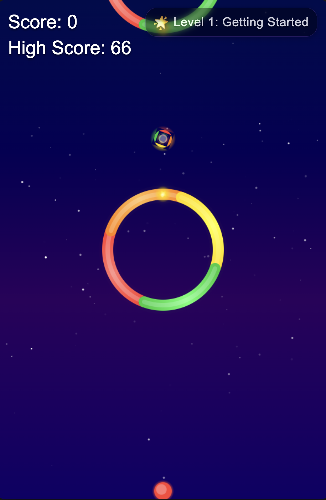

# Color Switch Clone

A visually stunning and feature-rich recreation of the popular Color Switch game, enhanced with additional gameplay mechanics, power-ups, and visual effects.



## Author

**Bennet Nkolele**  
GitHub: [benighter](https://github.com/benighter)

## Table of Contents

- [Description](#description)
- [Features](#features)
- [Installation](#installation)
- [How to Play](#how-to-play)
- [Game Mechanics](#game-mechanics)
- [Technologies Used](#technologies-used)
- [Development](#development)
- [License](#license)

## Description

Color Switch Clone is an addictive arcade-style game where players must navigate a ball through color-coded obstacles. The core mechanic is simple - the ball can only pass through obstacles of the same color. Players must time their jumps carefully and collect color switchers to change the ball's color and progress through increasingly challenging levels.

This version enhances the original concept with:
- Progressive level system
- Power-ups with unique effects
- Creative Mode for casual play
- Dynamic visual effects
- Responsive design for different screen sizes

## Features

### Core Gameplay
- **Color-Matching Mechanics**: Ball can only pass through obstacles of matching colors
- **Physics-Based Movement**: Realistic gravity and jump mechanics
- **Increasing Difficulty**: Game becomes progressively more challenging as you score higher

### Level System
- **5 Unique Environments**:
  - Level 1: Cosmic (Standard circular obstacles)
  - Level 2: Nebula (Introduces pulsating obstacles)
  - Level 3: Vortex (Features chaotic moving segments)
  - Level 4: Aurora (Adds inner ring obstacles)
  - Level 5: Black Hole (Combines all previous challenges)

### Power-ups
- **Shield**: Protects from one collision with a wrong color
- **Slow Motion**: Reduces game speed temporarily for precision movement
- **Magnet**: Pulls stars and other power-ups toward the ball
- **Multicolor**: Allows passing through any color for a limited time
- **Shrink**: Reduces ball size to navigate tight spaces more easily

### Visual Effects
- **Particle Systems**: Explosions, trails, and ambient effects
- **Dynamic Backgrounds**: Each level features unique visual themes
- **Animation Effects**: Smooth transitions and feedback animations
- **Screen Shake**: Adds impact to collisions and special events

### Game Modes
- **Regular Mode**: Standard gameplay with lives and increasing difficulty
- **Creative Mode**: Infinite play without game over for casual enjoyment

### UI Features
- **Responsive Design**: Adapts to different screen sizes
- **Dynamic HUD**: Shows score, level, and active power-ups
- **Tooltips**: Helpful information about power-ups and game elements
- **Main Menu**: Level selection and game settings

## Installation

### Prerequisites
- Node.js (v12 or higher)
- Web browser with modern JavaScript support

### Setup
1. Clone the repository:
   ```
   git clone https://github.com/benighter/color-switch-clone.git
   cd color-switch-clone
   ```

2. Start the local server:
   ```
   node server.js
   ```

3. Access the game:
   Open your browser and navigate to `http://localhost:3000`

## How to Play

### Controls
- **Click** or **Spacebar**: Jump
- **Escape**: Pause/Return to menu

### Objective
1. Guide the colored ball through obstacles of matching colors
2. Collect stars to increase your score
3. Use color switchers to change your ball's color
4. Collect power-ups for special abilities
5. Progress through levels by reaching score thresholds
6. Avoid colliding with obstacle segments of different colors

### Tips
- Time your jumps carefully to maintain control
- Watch for the next color switcher to plan your route
- Power-ups can help in challenging sections
- Creative Mode is perfect for practicing difficult obstacles
- Each level introduces new obstacle behaviors - adapt your strategy

## Game Mechanics

### Ball Physics
- The ball is affected by gravity
- Jumping gives vertical momentum
- Careful timing is required for precise navigation

### Obstacles
- Rotating segments of different colors
- Only segments matching the ball's color can be passed through
- Various types appear in different levels:
  - Standard rotation
  - Pulsating size
  - Chaotic movement
  - Inner ring variations

### Scoring
- +1 point for passing each obstacle
- +5 points for collecting stars
- High scores are saved locally

### Level Progression
- Level 1: 0-9 points
- Level 2: 10-24 points
- Level 3: 25-49 points
- Level 4: 50-79 points
- Level 5: 80+ points

### Power-up System
- Power-ups appear randomly during gameplay
- Active power-ups are displayed in the HUD with remaining duration
- Some power-ups stack, others override previous effects
- Shield power-up is saved until needed

## Technologies Used

- **JavaScript (ES6+)**: Core game logic and mechanics
- **HTML5 Canvas**: Rendering game graphics
- **CSS3**: UI styling and animations
- **Node.js**: Local development server
- **Local Storage API**: Saving game progress and settings

## Development

The game architecture is based on modular JavaScript classes:

- `Ball.js`: Player-controlled ball with physics
- `Obstacle.js`: Color-coded rotating obstacles
- `ColorSwitcher.js`: Items that change the ball's color
- `Star.js`: Collectible scoring items
- `Powerup.js`: Special ability items
- `Effects.js`: Visual effects system
- `Background.js`: Dynamic themed backgrounds
- `LevelManager.js`: Level progression and difficulty scaling
- `game.js`: Main game loop and state management

## License

This project is licensed under the MIT License - see the LICENSE file for details.

---

Enjoy the game! For issues, suggestions, or contributions, please open an issue on GitHub.
